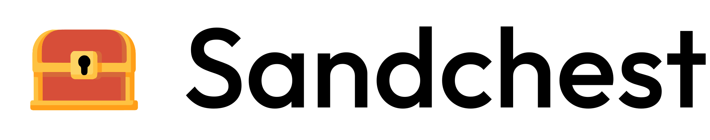

  <picture>
    <source media="(prefers-color-scheme: dark)" srcset="./sandchest-logo-dark.svg">
    <source media="(prefers-color-scheme: light)" srcset="./sandchest-logo.svg">
    
  </picture>

  
<strong>Open coding models for every agent, one flat price.</strong>

  

    
    
  

## Open coding models for every agent, one flat price.

Sandchest is open source. It gives Claude Code, Cursor, OpenCode and any
compatible client one key and one base URL for a growing lineup of open coding
models, with a flat monthly price instead of a per-token meter.

The aim is all-you-can-eat tokens for real developer use. But all-you-can-eat
doesn't mean backing a truck up to the buffet, so fair usage limits apply.

Sandchest is a work in progress.

## What's in the chest?

The best open coding models, all behind one open-source gateway. Use the right
model for each coding-agent run.

The goal is not to hide the models or pretend they are all the same. The goal is
to make them easy to reach from the agents people already use.

## Connect in three steps

Use the agent you already use. Change the base URL, add your Sandchest key, and
pick a model.

1. Grab your key.
2. Point your agent at Sandchest.
3. Code without per-token math.

You can view your fair usage limits directly from the Sandchest console.

Anything that lets you set a custom OpenAI- or Anthropic-compatible endpoint
should be able to use Sandchest: Claude Code, Cursor, OpenCode, Cline, Aider,
Continue, your own scripts, all on the same key and base URL.
